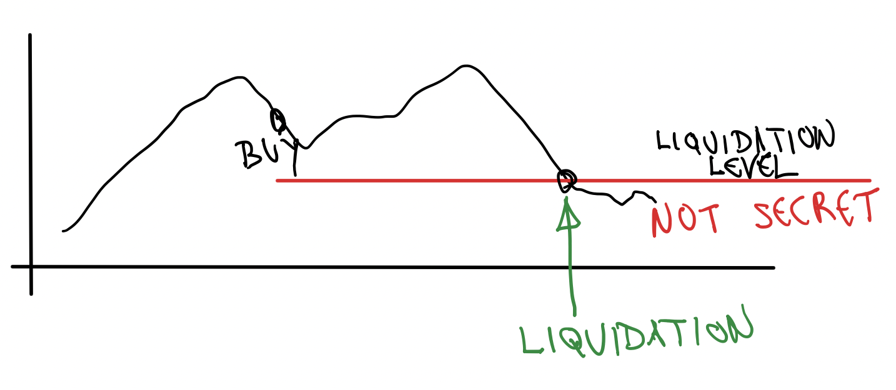
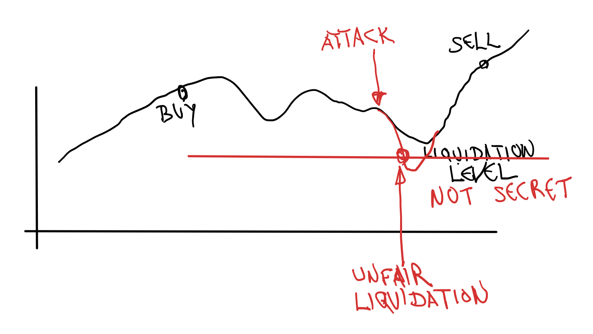
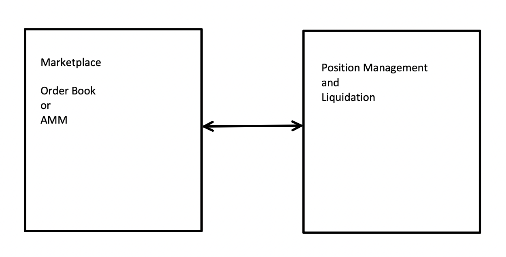
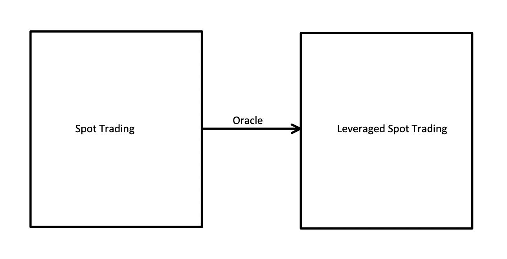
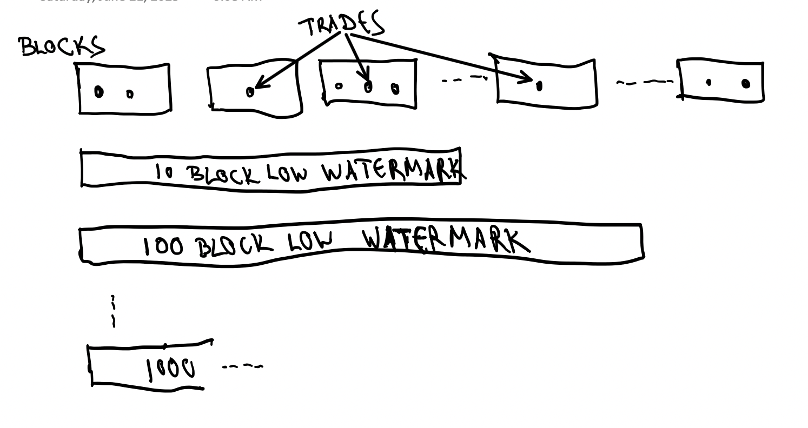
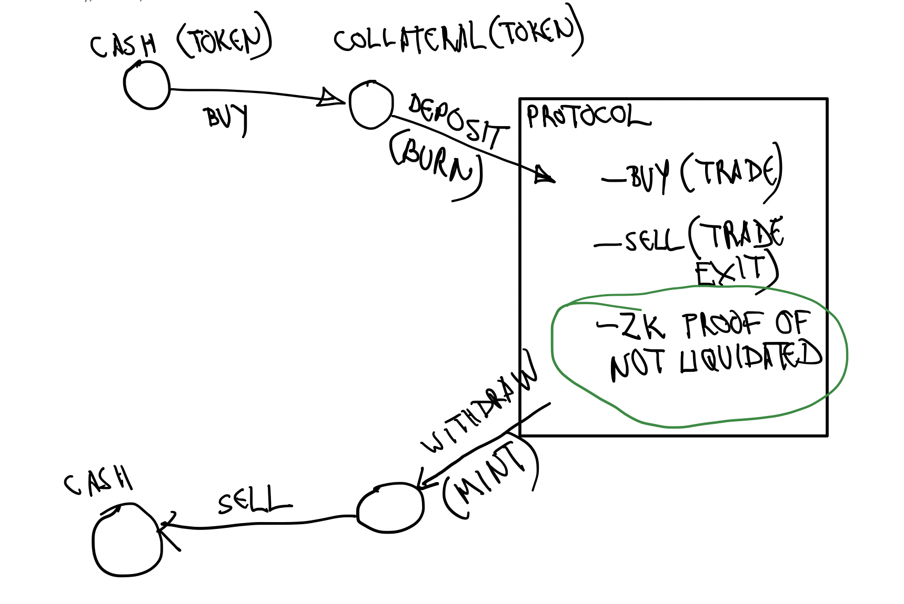
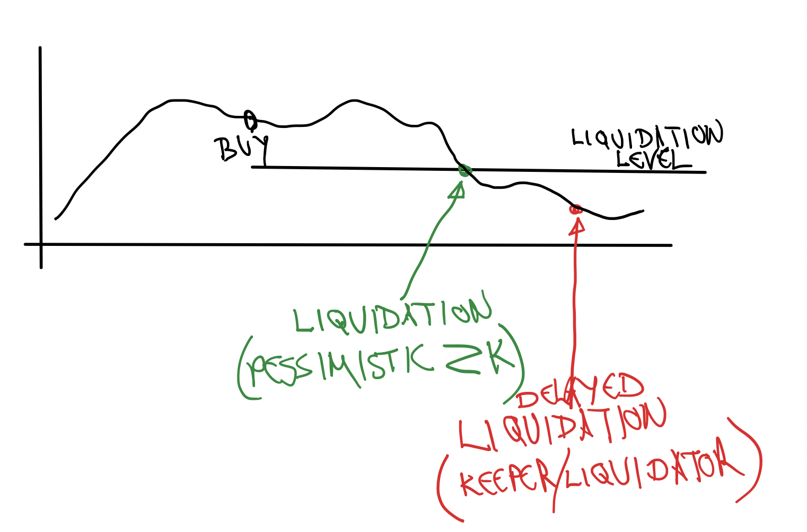

# Pessimistic ZK Fair Liquidation: Price Attack-free Leveraged Trading

## Abstract

Leveraged trading on-chain is challenging because everyone’s positions and stop-loss levels are publicly visible, leaving traders exposed to front-running, MEV, and flash-loan attacks that can unfairly force liquidations.

To eliminate this attack vector, we’ve developed a novel zero-knowledge approach that keeps each position’s liquidation thresholds and stop orders completely private. Instead of waiting for an attacker to trigger a forced sale, our system ***assumes every position is already liquidated*** and shifts the burden of proof onto the trader: they must supply a ZK proof that, under no possible market scenario, their position could have been liquidated. Only once that proof verifies do they recover their funds.

This inversion—“liquidate by default, prove otherwise”—ensures that no adversary can ever discover or manipulate another trader’s liquidation point, making on-chain liquidation both safe and fair.

## Introduction

Let's not make a mistake: ***delinquent trading positions should be liquidated***:

Yet, we should ***not allow anyone to induce liquidations*** via market manipulation, MEV or Flash Loans.
The problem in on-chain trading is that the liquidation points are public and the attacker can take advantage of this.

In general on-chain Leveraged Trading systems would have two components:
- Marketplace, such Order Book or Automated Market Maker (AMM). This allows
for price discovery and order execution.
- Position Management and Liquidation system. This allows for leverage via borrowing of real and/or virtual funds and liquidation of delinquent positions.

This prototype implements the latter, which can be combined with any Order Book
Marketplace. We are showing this in an example of Leveraged Spot Trading system, although it is not limited to it.

### What this is and what it's not

This is:

- a market Position Management solution for Leveraged Spot and Leveraged Perpetual Futures (Perps) protocols,
- a marketplace for leveraged trading and fair liquidations using our novel Pessimistic ZK technique,
- NOT attempting order privacy. Such feature can be combined into this project from techniques already available in the Awesome Aleo collection,
- A marketplace that can be combined with any Order Book. Both Makers and Takers can take advantage of the liquidation fairness achieved,
- NOT a tool to evade liquidation of truly delinquent positions,
- a tool to avoid positions being liquidated by market manipulations.

### Leveraged Spot Trading - anatomy

The Leveraged Spot Trading system can rely on a lender to fund the trader
in exchange for a fee and/or interest. However, this is not necessary in on-chain implementations. The Leverage can be achieved merely via accounting,
known as Contracts for Difference (CFD) trading instrument in the traditional
finance. In it, the Average Entry Price (which could be negative) is maintained throughout the position changes until the position is exited (flat). Finally, the difference between the Exit and the Average Entry Price is paid to the trader, or paid by the trader if negative.

In our implementation we will assume that the trader enters a position and
exits flat, with no intermediate changes of position size and direction.

To implement this tracking, we need an oracle. The spot price trades serve
as a perfect oracle, which is the reason why Leveraged Spot Trading protocols are combined with non-leveraged (fully funded) Spot trading.

### Leveraged Perpetual Futures (Perps) - anatomy

Futures Contracts without leverage are not practical. A farmer would use Futures Contracts to hedge against crops price fluctuations. Yet they do not want or have the funds to cover the entire crops proceeds in advance. Instead
they leverage to commensurate the expected proceeds difference due to crops
price fluctuation.

Perpetual Futures (Perps) are simply never-expiring rollovers of frequently expiring Futures Contracts. Upon expiration and rollover to a newer contract
the difference between the new and the old contract (which could be negative)
is paid by the holder to the issuer in form of a "funding rate". The funding rate also reflects the difference between the Perp and the Spot prices.

Our Pessimistic ZK Fair Leverage Position Management technique could be implemented in conjunction with a Perp Order Book marketplace, and it would
manage the liquidation of the leveraged positions. However, to avoid dealing
with Funding Rates and lifetime management of the Perp contracts, we will
stay with leveraged spot trading marketplace and leave the Perp implementation
for the future.

## Solution

### Why Pessimistic

- Avoid position health calculation by 3rd party (FHE or MPC solution too expensive).
- Avoid active participation / keepers.

## Implementation

In this prototype we are implementing management of Long Leveraged Positions. The Short Leveraged Position management is simply a mirror image. Whenever we
mention "price low watermark", in the Long case, "price high watermark" would
be used in the implementation of the Short case.

### Trade History Record

### Position funding

- Collateral tokens

- Collateral minting from funding

- Collateral burn -> record of deposit

- ZK Proof -> collateral mint

- Collateral burning from refund

### Proof of non-delinquency

- Loop through order history

- Order history shortening

## Surprising additional benefit

As already mentioned, keeping the liquidation levels private protects the trader against:
- Market Manipulation
- MEV
- Flash Loans

However, in addition we get the benefit of no delays in the liquidation process. In classical liquidation there is a delay between the time the liquidation is triggered and actually executed. This is a source of lower capital efficiency, which The Pessimistic ZK Fair Liquidation alleviates:

## Future Work
