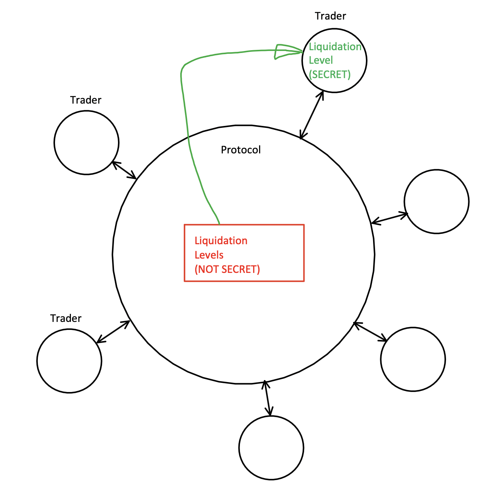

# Pessimistic ZK Fair Liquidation: Price Attack-free Leveraged Trading

## Demo and Video

The demo instructions and the video are [here](./demo/README.md).

## Abstract

Leveraged trading on-chain is challenging because everyone’s positions and stop-loss levels are publicly visible, leaving traders exposed to front-running, MEV, and flash-loan attacks that can unfairly force liquidations.

To eliminate this attack vector, we’ve developed a novel zero-knowledge approach that keeps each position’s liquidation thresholds and stop orders completely private. Instead of waiting for an attacker to trigger a forced sale, our system ***assumes every position is already liquidated*** and shifts the burden of proof onto the trader: they must supply a ZK proof that, under no possible market scenario, their position could have been liquidated. Only once that proof verifies do they recover their funds.

This inversion—“liquidate by default, prove otherwise”—ensures that no adversary can ever discover or manipulate another trader’s liquidation point, making on-chain liquidation both safe and fair.

## Introduction

Let's not make a mistake: ***delinquent trading positions should be liquidated***:


The protocol should ***not allow anyone to induce liquidations*** via market manipulation, MEV or Flash Loans.
The problem in on-chain trading is that the liquidation points are public and the attacker can take advantage of this.


In general on-chain Leveraged Trading systems would have two components:
- Marketplace, such Order Book or Automated Market Maker (AMM). This allows
for price discovery and order execution.
- Position Management and Liquidation system. This allows for leverage via borrowing of real and/or virtual funds and liquidation of delinquent positions.

This prototype implements the latter, which can be combined with any Order Book
Marketplace. We are showing this in an example of Leveraged Spot Trading system, although it is not limited to it.


### What this is and what it's not

This is:

- a market Position Management solution for Leveraged Spot and Leveraged Perpetual Futures (Perps) protocols,
- a marketplace for leveraged trading and fair liquidations using our novel Pessimistic ZK technique,
- NOT attempting order privacy. Such feature can be combined into this project from techniques already available in the Awesome Aleo collection,
- A marketplace that can be combined with any Order Book. Both Makers and Takers can take advantage of the liquidation fairness achieved,
- NOT a tool to evade liquidation of truly delinquent positions,
- a tool to avoid positions being liquidated by market manipulations.

### Leveraged Spot Trading - anatomy

The Leveraged Spot Trading system can rely on a lender to fund the trader
in exchange for a fee and/or interest. However, this is not necessary in on-chain implementations. The Leverage can be achieved merely via accounting,
known as Contracts for Difference (CFD) trading instrument in the traditional
finance. In it, the Average Entry Price (which could be negative) is maintained throughout the position changes until the position is exited (flat). Finally, the difference between the Exit and the Average Entry Price is paid to the trader, or paid by the trader if negative.

In our implementation we will assume that the trader enters a position and
exits flat, with no intermediate changes of position size and direction.

To implement this tracking, we need an oracle. The spot price trades serve
as a perfect oracle, which is the reason why Leveraged Spot Trading protocols are combined with non-leveraged (fully funded) Spot trading.


### Leveraged Perpetual Futures (Perps) - anatomy

Futures Contracts without leverage are not practical. A farmer would use Futures Contracts to hedge against crops price fluctuations. Yet they do not want or have the funds to cover the entire crops proceeds in advance. Instead
they leverage to commensurate the expected proceeds difference due to crops
price fluctuation.

Perpetual Futures (Perps) are simply never-expiring rollovers of frequently expiring Futures Contracts. Upon expiration and rollover to a newer contract
the difference between the new and the old contract (which could be negative)
is paid by the holder to the issuer in form of a "funding rate". The funding rate also reflects the difference between the Perp and the Spot prices.

Our Pessimistic ZK Fair Leverage Position Management technique could be implemented in conjunction with a Perp Order Book marketplace, and it would
manage the liquidation of the leveraged positions. However, to avoid dealing
with Funding Rates and lifetime management of the Perp contracts, we will
stay with leveraged spot trading marketplace and leave the Perp implementation
for the future.

## Solution

The core problem is ***secrecy of the liquidation levels***. The
protocol cannot actively protect them, unless we use extremely inefficient
cryptographic methods such as FHE and/or MPC. To solve this, we keep
the secret liquidation levels with the traders:



But the traders do not want to liquidate themselves! Read on...

### Why Pessimistic

We have seen before "Optimistic Rollups", "Optimistic Flash Loans", but why "Pessimistic" and how is this fair?

The problem of liquidation in real time requires a solution with active participation. To add privacy to it, we would need to use Fully Homomorphic Encryption (FHE) or Multi Party Computation (MPC), but this would be too
expensive and slow, causing additional delay in liquidations, making the
system even less capital-efficient.

So, how do we solve the problem od liquidation without active participation?
Here is the outline:

```
Protocol: 
- You placed a trade, 
- we’ll assume you are delinquent,
- but, keep trading - you are already (assumed) liquidated!

Trader:
- I am not delinquent, here is a ZK proof!

Protocol: 
- OK, my precautionary mistake, here is your collateral back.
```

To clarify:
- The trader has to purchase Collateral Tokens using actual asset Tokens, and deposit such collateral.
- As soon as the trader initiates a trade, the protocol "burns" the collateral, assuming immediate Trader's delinquency.
- If and when the Trader can exit the trade by proving that it "could not have been delinquent", the protocol re-mints the burned collateral in addition to the accrued profit/loss in the trade.

Here is the diagram:


## Implementation

In this prototype we are implementing management of Long Leveraged Positions. The Short Leveraged Position management is simply a mirror image. Whenever we
mention "price low watermark", in the Long case, "price high watermark" would
be used in the implementation of the Short case.

### Trade History Record

It would be very inefficient if the prover were to go through all trades that
occurred while the Trader was in position in order to prove that the position
is not subject to liquidation.

Instead, the protocol keeps it's "Tick Mill" by keeping price low watermark
in sequences of multiple blocks. As soon as a new trade comes in, the protocol
updates all such sequences. This is not much of an overhead (log-space) as
these sequences are constant multiple in size of shorter such sequences (for example 10):


Then, the proof would go through a ```log(n)``` of ```n``` items instead of whole ```n```. Such proof becomes feasible even for positions of very long durations.

### Position funding

- Collateral Tokens are implemented using the Aleo Token Registry program. Note
that the protocol is authorized to mint and burn such Collateral Tokens, of 
course in a controlled manner, governed by its program.

- The protocol provides a one-to-one exchange between actual assets (USDC) and
Collateral Tokens, in both directions.

- When Collateral Tokens are deposited, the depositor receives a private
Voucher (private Aleo Record), which could be later redeemed.

- As soon as the ZK Proof us generated off-chain, the protocol closes the position on-chain after verifying this proof. The prover has to receive an
appropriate set of low price watermark block sequences to prove it's conjecture. In this process, the Voucher is fed to the off-chain proof, which
mints private Collateral Tokens in the amount of the previously burned collateral + the profit (- the loss) of the trade.

### Proof of non-delinquency

The prover has to loop through the given sequences as public inputs
and assert / prove that the low watermark sequences cover the entire duration of the trade. In addition, no given low watermark should be lower than the
liquidation level of the trade position.

It is the responsibility of the front-end of the application to gather such
sequences of low watermarks and feed them in a sorted order to minimize the
computation required to generate the proof.

## Surprising additional benefits

As already mentioned, keeping the liquidation levels private protects the trader against:
- Market Manipulation
- MEV
- Flash Loans

However, in addition we get the benefit of no delays in the liquidation process. In classical liquidation there is a delay between the time the liquidation is triggered and actually executed. This is a source of lower capital efficiency, which The Pessimistic ZK Fair Liquidation alleviates:


Finally, this system can be used even for non-leveraged trading, to protect Stop Loss orders. Even Stop Loss orders are subject to "insider information"
attack. Long time ago, a typical crime would have been to call the institutional broker over the phone and ask them to (illegally) tell the
Stop Order prices. Pessimistic ZK can fix this as well.

## Future Work

Note that this prototype only implements the Liquidation Engine. To complete
this as a usable application we need to fully implement the following:
- Order Book for Spot and Leveraged trading, which records watermarks for both.
- The mirror image of the Long Position Liquidation Engine, but for Short positions.
- Perpetual Futures (Perp) Order Book, if we want to implement Perp trading.
- Stop Loss system, if we want to implement Stop Loss orders.